# 🚀 Release Process Guide

This guide explains how to create releases using our automated CI/CD workflow with Changesets.

## 📋 Prerequisites

- [x] Repository has proper permissions configured
- [x] `NPM_TOKEN` secret is set in GitHub repository settings
- [x] You understand [Semantic Versioning](https://semver.org/)

## 🔄 Release Workflow Overview

```mermaid
graph LR
    A[Create Feature Branch] --> B[Make Changes]
    B --> C[Create Changeset]
    C --> D[Create PR]
    D --> E[Code Review]
    E --> F[Merge to Main]
    F --> G[Auto Release PR]
    G --> H[Merge Release PR]
    H --> I[🎉 Published!]
```



## 📝 Step-by-Step Process

### 1. Feature Development

```bash
# Create and switch to feature branch
git checkout -b feature/your-feature-name

# Make your changes
# ... code code code ...

# Test your changes
pnpm test
pnpm build
```

### 2. Create Changeset

**Before creating your PR**, create a changeset to document your changes:

```bash
# Create changeset
pnpm changeset
```

You'll be prompted to:

#### a) Select Change Type
- **patch** (1.0.0 → 1.0.1) - Bug fixes, small improvements
- **minor** (1.0.0 → 1.1.0) - New features, backwards compatible
- **major** (1.0.0 → 2.0.0) - Breaking changes

#### b) Write Change Summary
Write a clear description of what changed:

```markdown
## New Feature: User Authentication

- feat: Add login/logout functionality
- feat: Add JWT token validation
- feat: Add user session management
- fix: Resolve security vulnerability in auth flow

Added comprehensive user authentication system with session management.
```

### 3. Commit and Push

```bash
# Commit your changes + changeset
git add .
git commit -m "feat: add user authentication system"

# Push to GitHub
git push origin feature/your-feature-name
```

### 4. Create Pull Request

1. Go to GitHub and create PR from your branch to `main`
2. Fill in PR template with:
   - Description of changes
   - Testing instructions
   - Screenshots (if UI changes)

### 5. Code Review & Merge

1. Wait for code review approval
2. Merge PR to `main` branch
3. **🎯 This triggers the automated release process!**

### 6. Automated Release Process

After merging to `main`, GitHub Actions will:

#### If changesets exist:
1. ✅ **Create Release PR** - Named "Version Packages"
2. 📝 **Update package.json** - Bump version number
3. 📋 **Update CHANGELOG.md** - Add your changes
4. 🏷️ **Prepare release notes**

#### If no changesets:
- ℹ️ No action taken (no release needed)

### 7. Publish Release

1. **Review the Release PR** that was automatically created
2. **Merge the Release PR**
3. 🎉 **Automatic publication**:
   - 📦 Published to NPM
   - 🏷️ Git tag created
   - 📋 GitHub release created

## 📊 Example Scenarios

### Scenario 1: Bug Fix

```bash
# Make bug fix
git checkout -b fix/validation-error

# Create changeset
pnpm changeset
# Select: patch
# Summary: "Fix validation error in form submission"

# Merge process results in: 1.2.3 → 1.2.4
```

### Scenario 2: New Feature

```bash
# Add feature
git checkout -b feature/user-dashboard

# Create changeset
pnpm changeset
# Select: minor
# Summary: "Add user dashboard with analytics"

# Merge process results in: 1.2.3 → 1.3.0
```

### Scenario 3: Breaking Change

```bash
# Breaking change
git checkout -b breaking/api-restructure

# Create changeset
pnpm changeset
# Select: major
# Summary: "Restructure API - requires migration"

# Merge process results in: 1.2.3 → 2.0.0
```

## 🛠️ Useful Commands

```bash
# Check changeset status
pnpm changeset status

# Preview what will be released
find .changeset -name "*.md" -not -name "README.md"

# Dry run release (local testing)
pnpm release:dry-run

# Run tests before release
pnpm test:coverage
```

## 📋 Changeset Best Practices

### ✅ Good Changeset Examples

```markdown
## Authentication System

- feat: Add user login/logout functionality
- feat: Add JWT token validation  
- feat: Add session management
- docs: Update API documentation

Complete authentication system with secure token handling.
```

```markdown
## Bug Fixes

- fix: Resolve memory leak in data processing
- fix: Correct validation logic for email fields
- perf: Improve query performance by 40%

Critical bug fixes improving stability and performance.
```

### ❌ Poor Changeset Examples

```markdown
# Too vague
- Fixed stuff
- Updated things
- Various improvements
```

```markdown
# Too detailed (save for commit messages)
- fix: resolve issue where user authentication fails when email contains special characters like + or . in the local part before @ symbol, which was causing regex validation to fail incorrectly
```

## 🔍 Troubleshooting

### Release PR Not Created
- ✅ Check if changeset files exist in `.changeset/` folder
- ✅ Verify GitHub Actions permissions
- ✅ Check workflow logs in Actions tab

### NPM Publish Failed
- ✅ Verify `NPM_TOKEN` is set correctly
- ✅ Check NPM package name availability
- ✅ Verify package.json `publishConfig`

### Version Not Updated
- ✅ Ensure changeset was committed before merge
- ✅ Check if changeset format is correct
- ✅ Verify merge to correct branch (`main`)

## 📞 Need Help?

1. **Check workflow logs**: GitHub → Actions tab
2. **Verify changeset format**: `.changeset/` folder
3. **Test locally**: `pnpm changeset status`
4. **Ask team**: Share workflow logs for debugging

## 🎯 Quick Reference

| Action | Command | Result |
|--------|---------|---------|
| Add changeset | `pnpm changeset` | Documents changes |
| Check status | `pnpm changeset status` | Shows pending changes |
| Preview version | Look at Release PR | Shows next version |
| Test locally | `pnpm release:dry-run` | Simulates release |

---

**Remember**: Always create changesets before merging! This ensures your changes are properly documented and versioned. 🚀